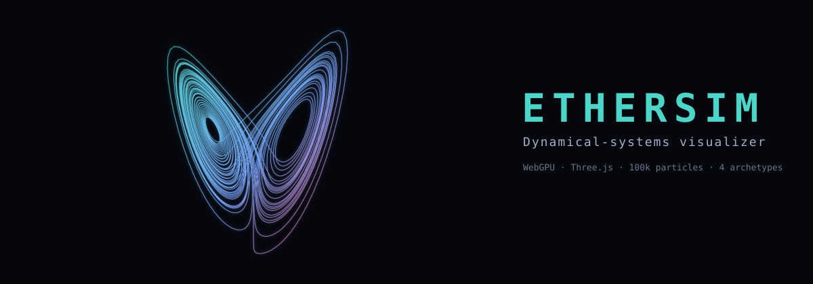
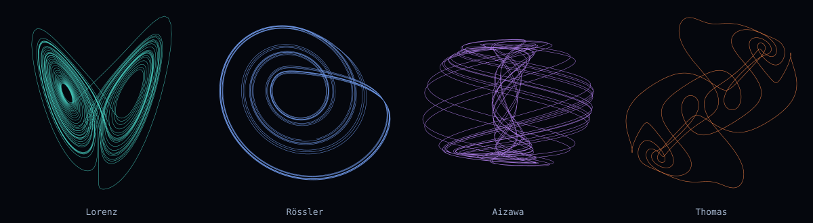
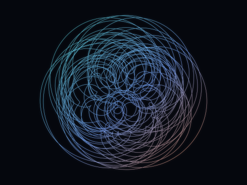
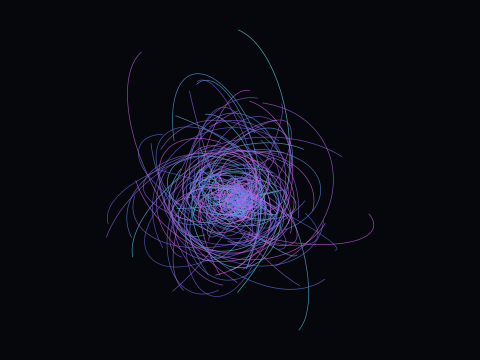
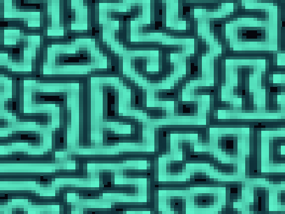

<p align="center">
  
</p>

<p align="center">
  
  
  
  
</p>

# ETHERSIM

Interactive, high-performance visualizer for complex dynamical systems — strange attractors,
hierarchical hyper-oscillators, scale-invariant N-body, and cellular-automata "quantum foam" —
all running locally at 100k-particle scale in the browser via WebGPU. One plugin engine, four
mathematical archetypes, live-switchable, with fading trails, a structural hierarchy navigator,
camera focus-tracking, JSON snapshots, and an optional fully GPU-resident compute path.

## Highlights
- **A growing catalog behind one seam** — 14 strange attractors, 11 iterated maps, a **Fractal**
  family (Barnsley fern + IFS chaos-game, Mandelbrot/Julia/Burning-Ship escape-time, DLA), an
  emergent **Life** family (Particle Life, Boids, slime mold), **Fluid** (point vortices) and
  **Field** systems (Gray-Scott foam, excitable-medium waves, Lenia), plus the hyper-oscillator and
  N-body — **136 systems across 10 categories**, switchable live, no reload. Adding one is a single
  file + one `register()` call.
- **Learn as you go** — a built-in **Learn panel** (About / Math / Code) explains every system in
  plain English, renders its governing equations with **KaTeX** (with your live slider values
  substituted in), shows the core source, and links out to references.
- **Decoupled simulation** — the integrator runs in a Web Worker over a SharedArrayBuffer
  double-buffer (with a main-thread fallback), independent of the render frame rate.
- **GPU by default** — most systems have a fully GPU-resident **TSL** compute path:
  per-particle RK4 (attractors), map iteration, chaos-game IFS, per-pixel escape-time fractals with
  live zoom, brute-force `Loop` flocking/particle-life, an atomic-scatter slime trail field, softened
  Biot–Savart vortices, ring-kernel Lenia + Gray-Scott / integer-grid CA, walker-aggregation DLA, and
  all-pairs N-body. The **GPU compute** toggle is live for the whole catalog.
- **Fading world-space trails**, a **hierarchy tree** with particle highlighting and
  **macro→micro camera focus-tracking**, **logarithmic depth/zoom**, and **versioned JSON
  snapshots**.
- **Correctness gate, not vibes** — a test asserts the Benettin method reproduces the Lorenz
  largest Lyapunov exponent ≈ 0.9056; the app also computes it live.

## Archetypes
The images below are rendered **from this project's own integrators** — real trajectories and
fields, not stock art. Every system runs on the CPU worker path **and** has an optional fully
GPU-resident TSL compute path — toggle **GPU compute** to move the active system onto the GPU.

### Strange attractors
<p align="center"></p>

Fourteen chaotic flows — Lorenz, Rössler, Aizawa, Thomas, Halvorsen, Chen, Dadras, Lorenz-84,
Rabinovich–Fabrikant, Sprott-Linz F, Wang four-wing, Bouali, Nosé–Hoover, Chua — each a
100k-particle RK4 ensemble with its own stable timestep. Correctness is gated on the Benettin
Lyapunov exponent, computed live (e.g. Lorenz ≈ 0.906, Chen ≈ 2.0), not visual plausibility.
**Next:** live Lyapunov-spectrum + Kaplan–Yorke dimension.

### Iterated maps
Eleven classic discrete maps — Clifford, de Jong, Svensson, Hopalong, Gumowski–Mira, Tinkerbell,
Ikeda, Hénon, Lozi, Bedhead, and the 3D Pickover — each a 100k-point cloud that settles onto the
attractor, with fading trails tracing the filaments.
**Next:** more families (standard/Chirikov, Gingerbreadman).

### Fractals
Three flavours: **IFS chaos-game** attractors (Barnsley fern, Sierpiński triangle/carpet, Heighway
dragon) built by random affine contractions; **escape-time** sets (Mandelbrot, Julia, Burning Ship)
as a per-cell grid whose smooth escape count is recomputed every frame on the GPU for live pan/zoom;
and **diffusion-limited aggregation** (DLA), random walkers freezing into coral/lightning dendrites.
**Next:** a per-pixel fragment-shader plane for crisper deep zoom; fractal flames; L-systems.

### Particle Life
K species in a toroidal cube governed by a random **asymmetric interaction matrix** — universal
short-range repulsion plus per-pair attraction/repulsion yields emergent cells, membranes, and
chasers (life from a matrix). Neighbour queries use a shared spatial-hash grid, so it scales to
16k+. Species are contiguous blocks, so the hierarchy tree spotlights each one; the "ecosystem"
slider reseeds the matrix for a new world.
**Next:** save/share for favourite ecosystems.

### Boids (flocking)
Reynolds flocking — separation, alignment, cohesion within a perception radius — in a toroidal
cube, with neighbour queries through the same spatial-hash grid (so flocks scale to tens of
thousands). Emergent streams, swirls, and murmurations.
**Next:** predators / obstacles, per-flock species.

### Slime mold (Physarum)
Agents wander a toroidal trail field, depositing a chemical and steering toward whichever of three
forward sensors smells strongest; the field diffuses and decays. They reinforce the paths they
travel, so emergent **transport networks** — veins, cells, voids — appear in the agent density.
This is the archetype that exercises the agent↔field feedback (`readField()`).
**Next:** food sources / obstacles, multi-species networks.

### Point Vortices
A handful of ± vortices induce a 2D velocity field (softened Biot–Savart, toroidal); thousands of
massless tracers are advected by it, so the streamlines reveal the flow — eddies pair, orbit, and
shed. Bounded by softening + wrap (can't blow up).
**Next:** vortex sheets, leapfrogging rings, 3D vortex filaments.

### Hierarchical hyper-oscillator
<p align="center"></p>

Nested phase oscillators driven by irrational constants (φ, π, e, Feigenbaum δ), parent-coupled
across levels — quasi-periodic, non-repeating orbital swarms.
**Next:** user-assignable drivers per level in the hierarchy tree, deeper nesting, a GPU path
beyond four levels, and a multi-scale "cosmos" variant that exercises true f64 floating-origin.

### Scale-invariant N-body
<p align="center"></p>

Plummer-softened all-pairs gravity (velocity-Verlet — symplectic, energy-conservation tested),
seeded as hierarchical clusters with a cross-scale binding term.
**Next:** GPU tiled all-pairs / Barnes–Hut for far higher body counts, relativistic & cross-scale
coupling variants, collisions/mergers, and GPU-side clusters.

### Quantum foam
<p align="center"></p>

A Gray-Scott reaction-diffusion field on a toroidal grid driving a displaced point lattice
(exposed via `readField()`) — mitosis / coral / maze patterns and emergent foam.
**Next:** more presets, feeding `readField()` into the other archetypes (gradient advection), and
3D reaction-diffusion.

### Excitable medium (spiral waves)
A Greenberg–Hastings cyclic cellular automaton (rest → excited → refractory → rest) on a toroidal
grid — self-organising travelling and spiral waves, a Belousov–Zhabotinsky look. Bounded by
construction (integer states), so it never blows up.
**Next:** FitzHugh–Nagumo / Gierer–Meinhardt siblings, phase colouring.

### Lenia (smooth life)
A continuous cellular automaton: the field is convolved with a smooth ring kernel each step, then
nudged by a Gaussian growth function and clamped to [0,1] — generalising Conway's Life to smooth
space, time, and states, yielding lifelike gliders and self-organising cells.
**Next:** the Orbium glider seed + a preset zoo; multi-channel Lenia.

## Stack
TypeScript (strict) · Vite · **Three.js r184** (`WebGPURenderer`, WebGPU-first) · **Lit** web
components · nanostores · Tweakpane · KaTeX · zod · vitest. Authoritative state is CPU **f64**; the GPU
renders **f32** (WGSL has no f64) — the split that satisfies "double-precision sim with
single-precision fallback".

## Run
```bash
bun install
bun run dev        # http://localhost:5173 — open in a WebGPU browser (Chrome / Edge / Safari 26+)
bun run test       # vitest: solvers, Lyapunov gate, schema round-trip, N-body energy, trails, …
bun run typecheck  # tsc --noEmit
bun run build      # tsc + vite production build
```
The dev/preview servers send `Cross-Origin-Opener-Policy` + `Cross-Origin-Embedder-Policy`
headers (required for the `SharedArrayBuffer` worker path). Toggle **GPU compute** in the panel's
Global folder to run the active archetype fully on the GPU.

## Architecture
The `Archetype` plugin seam (`src/core/archetype.ts`) is the spine: every system implements one
contract (`step` / `readPositions` / `readState` / `getHierarchy`) and declares its tunable
`ParamSpec` controls. The Simulation Manager never inspects physics, so adding an archetype is
one file + one `register()` call and the UI builds its sliders automatically.

```
src/core/        archetype seam, registry, simulation manager, params, color
src/physics/     constants, integrators (rk4), lyapunov, spatial grid (cell list)
src/archetypes/  attractors, maps, particle life, boids, hyper-osc, n-body, foam + registry
src/sim/         fixed-timestep accumulator, worker + SAB double-buffer driver, trail ring
src/render/      WebGPU renderer, points, trails, camera, floating-origin hook, theme
src/gpu/         TSL compute kernels per archetype (opt-in GPU-resident path)
src/state/       zod snapshot schema, migrations, seeded rng
src/ui/          nanostores store + Lit components
test/            vitest suites
docs/            generated hero / gallery art
```

Deeper design notes, the verified feasibility constraints, and the phased plan live in
[IMPLEMENTATION_PLAN.md](IMPLEMENTATION_PLAN.md).

## Roadmap
Most of the PRD is implemented; per-archetype plans are listed under each archetype above. The
cross-cutting engine work that remains:

- **f64 floating-origin precision** — the camera rebase hook is in place as a no-op; wiring the
  real f64 anchor only matters (and is only testable) once content spans many decades of scale
  (see the hyper-oscillator "cosmos" plan).
- **GPU-mode parity** — trails / highlight / focus are CPU-position features, so they're inactive
  in GPU-compute mode; bring them to the GPU (history ring in a storage buffer, GPU picking).
- **Real-hardware performance pass** — confirm and tune toward 100k @ 60fps; FPS-adaptive
  particle/trail budgets.
- **Shareable state** — snapshot deep-links / preset library; touch + mobile controls.

## License
[MIT](LICENSE).
